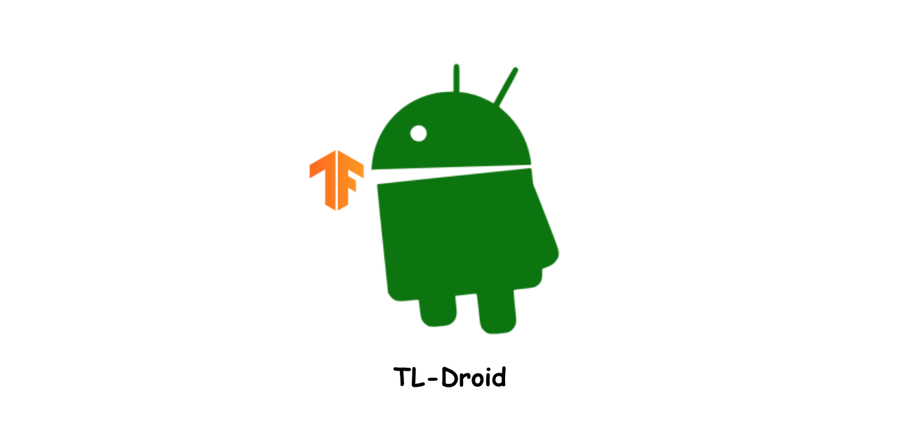

# TLDroid : Basic Tensorflow-Lite usecase and wrapping library for Android

TLDroid is a simple usecase of multiple machine-learning based service, such as image classification, speech sentiment analysis and others by using [Tensorflow-lite](https://www.tensorflow.org/lite?hl=ko).

It contains various wrapping android library (also for gradle implement by jCenter) for some usage, and prebuilt module that we used in [Mercy-App](https://github.com/mercy-project/mercy_app_v2) to classify real-time object in image and video.

This project was originally developed by the developers of [Mercy-Project](https://github.com/mercy-project), who are actively engaged in machine learning research and development.

You can also check out the following projects developed by Mercy-Project.

**`Project list developed by Mercy`** |
------------------------------------- |
[korean-text-sentiment-analysis](https://github.com/mercy-project/korean-text-sentiment-analysis) |
[korean-image-sentiment-analysis](https://github.com/mercy-project/korean-image-sentiment-analysis) |
[korean-audio-sentiment-analysis](https://github.com/mercy-project/korean-audio-sentiment-analysis) |
[mercy-emotion-app](https://github.com/mercy-project/mercy_app_v2) |

## Contribution Guide
If you want to contribute to TL-Droid, be sure to review the [contribution gudeline](). We have our own branch strategy and coding convention. Fore general questions and discussion, please contact us with our [offical email]()

1. [Kotlin Style Guide]()
2. [Naming Policy]()
3. [XML Style Guide]()
4. [Branch Strategy]()
5. [Github Label]()
6. [Release Strategy]()

**This guideline is not mandatory. If you make some of pull request which is not match with this guideline, we surely check your pull request and update our contribute guideline.**

## Official Builds
Library / Application name | Build Status | Build Type |
--------------- | ------- | ------|
app | not yet | gradle, Android application |
core | not yet | gradle, Android library |
classification | not yet | gradle, Android library |

## Official Contributors

**`Mercy-Project Members`** |
------------------------------------- |
[izen1231](https://github.com/izen1231) |
[rapsealk](https://github.com/rapsealk) |
[skfo763](https://github.com/skfo763) |
[howtowhy](https://github.com/howtowhy) |

## License
[Apache License 2.0](LICENSE)
